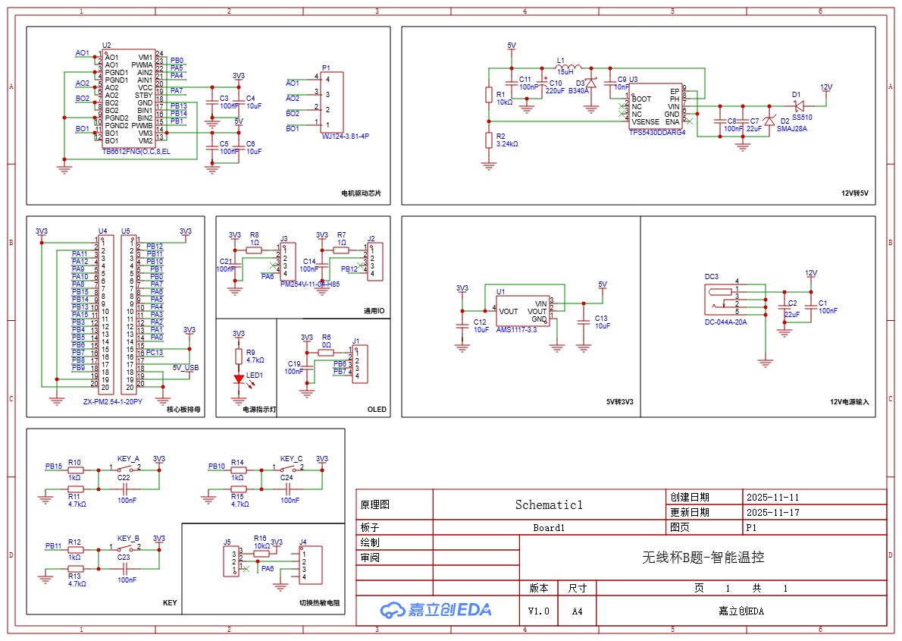

[中文](README.md) | **English**

# STM32 Intelligent Temperature Control System


[](https://github.com/welldone987/STM32_Temperature_Control/actions/workflows/stm32-ci.yml)

An intelligent temperature-control system based on the **STM32F103C8T6**. It measures ambient temperature with an NTC thermistor, displays system status on an OLED, supports threshold adjustment through buttons, and drives a fan through TB6612 + PWM.

The software has been refactored to a **STM32CubeMX / HAL + FreeRTOS + C++17 application layer** and is built with **STM32CubeCLT (GNU Arm Toolchain + CMake + Ninja)**.

## Features

- ADC1 + DMA continuous NTC sampling with the processing chain: 50-sample DMA average → median filter → moving average → Steinhart-Hart conversion → piecewise linear calibration
- OLED display for temperature, configured limits, fan state, and sensor faults
- High/low temperature threshold configuration with CRC16-protected on-chip Flash persistence
- TB6612 fan control with linear PWM regulation from 10% to 100% over 25–50 °C
- LED + buzzer alarm on temperature violations; automatic fan control is disabled on NTC faults
- USART1 runtime telemetry for temperature-chain and control-state debugging
- Fully static FreeRTOS task/queue allocation with no heap dependency; C++ exceptions, RTTI, and thread-safe static initialization are disabled

## Software Architecture

```text
src/
├─ App/                    C++17 application layer
│  ├─ common/              Shared types and configuration
│  ├─ control/             Fan and thermostat control logic
│  ├─ sensor/              NTC sampling, filtering, conversion and fault detection
│  ├─ display/             OLED and software I2C
│  ├─ storage/             Flash-backed settings persistence
│  ├─ rtos/                FreeRTOS tasks, queues and ISR glue
│  └─ config/              FreeRTOSConfig
├─ Core/                   STM32CubeMX-generated initialization and HAL glue
├─ Drivers/                STM32F1 HAL / CMSIS
├─ FreeRTOS/               FreeRTOS Kernel
├─ cmake/                  STM32CubeMX and GNU Arm CMake configuration
├─ CMakeLists.txt
├─ CMakePresets.json
├─ stairwayB.ioc
├─ STM32F103XX_FLASH.ld
└─ startup_stm32f103xb.s
```

The CubeMX-generated `main.c` enters the C++ application layer through a small C API:

```text
main.c
  ├─ app_init()
  │    ├─ Load persisted thresholds
  │    ├─ Start ADC DMA
  │    └─ Initialize actuators
  └─ app_start()
       └─ FreeRTOS Scheduler
            ├─ control   10 ms   Buttons / alarm / fan control
            ├─ sensor   100 ms   Temperature acquisition and filtering
            ├─ display  500 ms   Incremental OLED refresh
            └─ storage  event    Background Flash write
```

Tasks primarily exchange the latest state through length-one overwrite queues and task notifications, avoiding unnecessary mutexes and heap allocation.

## Hardware

- MCU: STM32F103C8T6, 72 MHz
- Temperature sensor: 10 kΩ NTC, PA6 / ADC1_IN6
- Fan driver: TB6612FNG, PB0 / TIM3_CH3 PWM
- OLED: PB6 / PB7 software I2C
- Debug UART: USART1, 115200-8-N-1
- Other peripherals: three setting buttons, thermostat switch, red/green LEDs, buzzer



## Build

Install STM32CubeCLT and ensure its `arm-none-eabi-gcc`, CMake, and Ninja executables are available in `PATH`.

```bash
cd src
cmake --preset Debug
cmake --build --preset Debug
```

Size-optimized build:

```bash
cmake --preset MinSizeRel
cmake --build --preset MinSizeRel
```

The ELF and map files are generated under `src/build/<Preset>/`.

For GPIO, ADC, DMA, TIM, or USART changes, edit `src/stairwayB.ioc` and regenerate with STM32CubeMX. Application logic is kept under `src/App/`, separated from the CubeMX-generated layer.

## CI

GitHub Actions builds both `Debug` and `MinSizeRel` with a STM32CubeCLT environment on every push and pull request, and uploads the ELF and map files as workflow artifacts.
